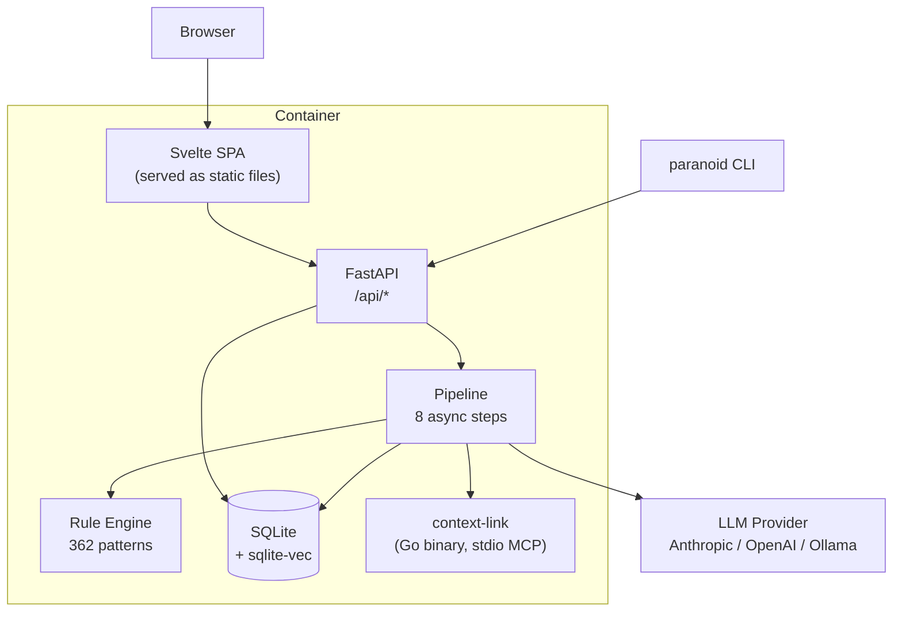

# Architecture

## Overview

Paranoid is a single Docker container combining a FastAPI backend, a Svelte SPA frontend, and a Go binary (context-link) for code indexing.



## Stack

| Layer | Technology |
|-------|-----------|
| Backend | Python 3.12, FastAPI, aiosqlite |
| Frontend | Svelte 5 (legacy mode), Tailwind CSS, svelte-spa-router |
| Database | SQLite + sqlite-vec (vector search) |
| Embeddings | fastembed (ONNX, local — no external API) |
| LLM providers | Anthropic, OpenAI, Ollama (protocol-based) |
| Code indexing | context-link Go binary (MCP over stdio) |
| Deployment | Docker Compose (3-stage build: Go + Node + Python) |

## Pipeline steps

The pipeline is a sequence of plain `async def` functions — no LangChain, no LangGraph.

```
Input (description + optional diagram + optional code)
  │
  ├─ summarize          → SystemSummary (~200 chars)
  ├─ extract_assets     → AssetsList (components, data stores, users)
  ├─ extract_flows      → FlowsList + TrustBoundaries
  │
  └─ for iteration in 1..N:
       ├─ generate_threats  → ThreatsList (STRIDE or MAESTRO)
       └─ gap_analysis      → GapSummary (feeds next iteration)
  │
  ├─ Rule Engine (always runs in parallel with LLM)
  ├─ Merge + dedup (cosine similarity ≥ 0.85)
  └─ [optional] enrich → AttackTrees + GherkinTestCases
```

**SSE events** are emitted per step by `runner.py`. The frontend subscribes via `EventSource`.

## Rule engine

Runs on every pipeline execution alongside the LLM. Results are merged and deduplicated by embedding cosine similarity (threshold: 0.85).

- **362 patterns** across 16 seed files: STRIDE, MAESTRO, OWASP LLM Top 10, MITRE ATT&CK, ATLAS, CAPEC, cloud misconfigurations (AWS/Azure/GCP), auth providers, infrastructure, message brokers, ORM patterns
- **Keyword + pattern matching** for initial filtering
- **Vector similarity search** via sqlite-vec for fuzzy matching
- **Never calls an external API** — local only

## LLM provider protocol

All three providers implement a single method:

```python
async def generate_structured(
    prompt: str,
    response_model: type[BaseModel],
    max_tokens: int = 4096,
) -> BaseModel: ...
```

| Provider | Structured output mechanism |
|----------|-----------------------------|
| Anthropic | Tool use (`tool_choice="any"`) + prompt caching |
| OpenAI | Structured Outputs (`client.chat.completions.parse`) |
| Ollama | `format=<json_schema>` |

All providers auto-bump `max_tokens` on truncation (up to 2× per step, max 2 retries).

## Database schema

Key tables (all have `id TEXT PRIMARY KEY`, `created_at`, `updated_at`):

| Table | Description |
|-------|-------------|
| `threat_models` | Pipeline runs, framework, provider, status, iteration count |
| `threats` | Individual threats with DREAD scores, category, status |
| `assets` | Extracted components and data stores |
| `data_flows` | Extracted data flows |
| `trust_boundaries` | Extracted trust boundary definitions |
| `pipeline_runs` | Audit log per step (token usage, duration, hash) |
| `users` | Account credentials, roles |
| `projects` | Project metadata and per-project defaults |
| `project_members` | User ↔ project role join table |
| `comments` | Threaded comments on models, threats, and entities |
| `notifications` | Per-user notification queue |
| `sources` | Code source registrations (git URL, status, encrypted PAT) |
| `schema_migrations` | Migration ledger (authoritative — not `schema.py` version) |

Schema changes: drop a file in `backend/db/migrations/NNNN_description.py` and implement `async def up(conn)`. The runner applies migrations at startup in filename order.

## Repository structure

```
backend/
  models/       state.py, extended.py, enums.py, api.py
  providers/    base.py (Protocol), anthropic.py, openai.py, ollama.py
  pipeline/     nodes/ (8 step files), runner.py, prompts/, confidence.py
  rules/        engine.py + 16 seed files in seeds/
  auth/         passwords.py (argon2), tokens.py (JWT/PAT), dependencies.py
  db/           schema.py, crud.py, crud_auth.py, crud_projects.py,
                crud_comments.py, crud_activity.py, crud_staleness.py,
                vectors.py, migrations/
  mcp/          client.py (context-link subprocess lifecycle)
  image/        encoder.py, mermaid.py, validation.py
  export/       pdf.py, sarif.py, markdown.py, _common.py
  routes/       models.py, threats.py, export.py, auth.py, sources.py,
                config.py, projects.py, comments.py, notifications.py,
                analyze.py, dashboard.py, diff.py
  security/     rate_limit.py
  sources/      manager.py, paths.py
frontend/src/
  routes/       Home, Dashboard, NewModel, Results, Review, AttackTree,
                Login, Register, Members, ProjectSettings, AdminUsers
  components/   Wizard, ThreatCard, DreadBadge, ModelCard, ProjectSelector,
                Comments, Assignees, EntityComments
  lib/          api.js, stores.js, utils.js
seeds/          362 patterns across 16 JSON files
cli/            Click CLI; input/diagram_loader.py
action/         GitHub Action definition + entrypoint
bin/            context-link binary (downloaded at Docker build time)
```

## Key design decisions

For the rationale behind major technical choices, see [.claude/rules/tech-decision-rationale.md](../.claude/rules/tech-decision-rationale.md). Highlights:

- **SQLite over Postgres** — zero infrastructure; threat models are small (20–100 threats)
- **Plain async functions over LangChain** — debuggable, minimal dependencies (12 total)
- **Deterministic rule engine always runs** — catches known patterns even when LLM is unavailable
- **Iterative pipeline (1–15 passes)** — gap analysis feeds subsequent iterations for deeper coverage
- **Svelte + Tailwind over React** — compiled to vanilla JS, no runtime, smaller bundle
